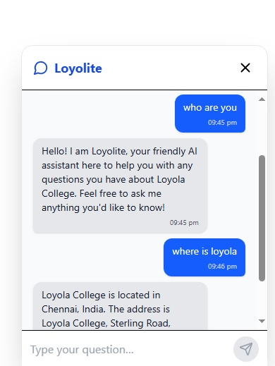
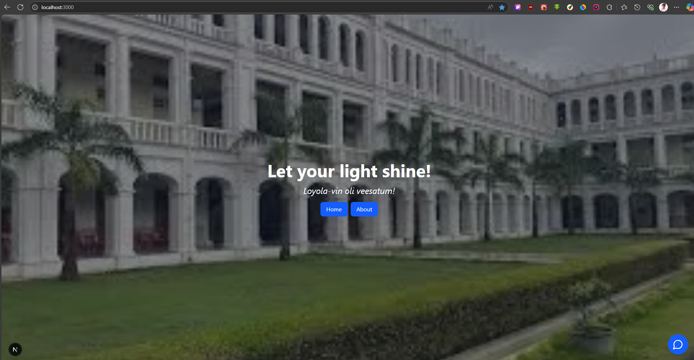
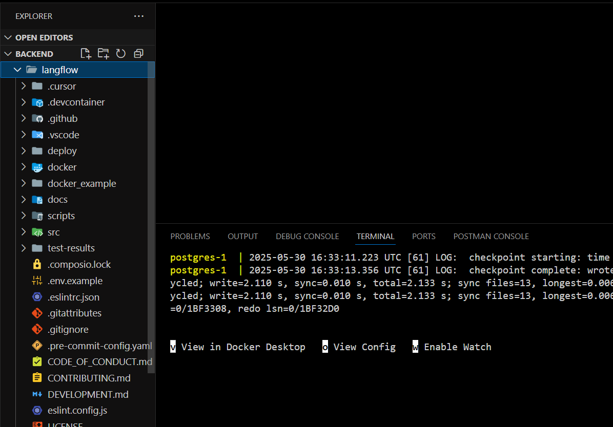
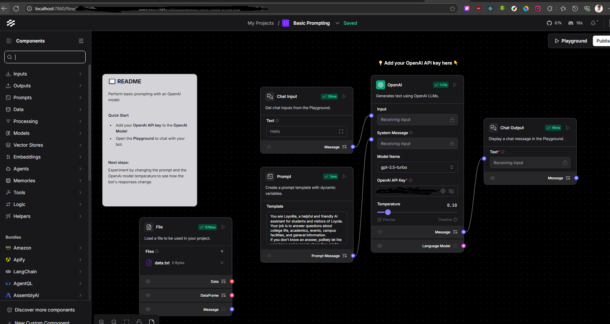

# Loyola Support Chat Application using Langflow

This project is a full-stack AI-powered chat support widget for a website, designed as a Q&A assistant for Loyola College. The backend leverages [Langflow](https://github.com/langflow-ai/langflow) to handle language model flows, while the frontend features a persistent React chat widget built with Next.js and Tailwind CSS. All chat interactions are logged for record-keeping and improvement.

---

## Chat output



## Page output



## backend





## Features

- Modern, floating chat widget for user support on any website page
- Real-time answers to user questions using OpenAI GPT models
- Langflow-powered backend for prompt management
- Chat history is stored with timestamps for auditing and analytics through file writing via node (json file)

---

## A similar project of mine for Anna university MBA dept:

- [https://www.domsauconnect.com](https://www.domsauconnect.com)
- Helps HRs to decide on the placements for the department using AI chatbot

## Project Structure

```
/app              # Next.js 15+ App Router frontend
  /components     # React UI components (ChatWidget, etc.)
  /api            # Next.js API routes for backend communication
/chatlog.json     # Local storage for chat logs (demo/development)
```

---

## Setup Instructions

### 1. Clone the Repository

```sh
git clone https://github.com/krish-1010/chatsupport.git
cd chatsupport
```

### 2. Set Up Langflow Backend

- Clone the official [Langflow](https://github.com/langflow-ai/langflow) repository in the `/backend` directory or your preferred location.
- Launch Langflow via Docker:

```sh
cd backend
git clone https://github.com/langflow-ai/langflow.git
cd langflow/docker_example
docker compose up
```

- Langflow UI will be available at [http://localhost:7860](http://localhost:7860).

### 3. Configure Your Langflow Flow

- Use Langflow’s UI to create a flow:
  - Accepts user queries as input
  - Uses an OpenAI model (requires OpenAI API key)
  - Returns the AI-generated response
- Export or note the flow’s API endpoint (visible in the UI).

### 4. Set Up the Next.js Frontend

**Install dependencies:**

```sh
npm install
```

**Start the frontend:**

```sh
npm run dev
```

Your site should be live at [http://localhost:3000](http://localhost:3000).

---

## Configuration

- You can customize the chat prompt and system behavior in Langflow’s Prompt node.
- For demo and testing, chat logs are stored locally in `chatlog.json`. For production, connect to a database.

---

## How It Works

- Users interact with the chat widget on any page.
- The widget sends messages to a Next.js API route, which forwards queries to the Langflow backend.
- Langflow processes the input with OpenAI.
- Responses are sent back and displayed in the chat UI.
- All user and AI messages are logged with timestamps.

---

## Customization

- To add custom data for Q&A (college information, FAQs, etc.) upload your documents/tweak the prompt template.
- Change the prompt template in Langflow’s Prompt node for different personalities or instructions.

---

## License

This project is for educational and demonstration purposes.

---

## Credits

- [Langflow](https://github.com/langflow-ai/langflow) for the backend orchestration
- [OpenAI](https://platform.openai.com/) for LLM APIs
- [Next.js](https://nextjs.org/) and [Tailwind CSS](https://tailwindcss.com/) for frontend development

---

## Contact

For questions or contributions, please open an issue or contact the maintainer.
